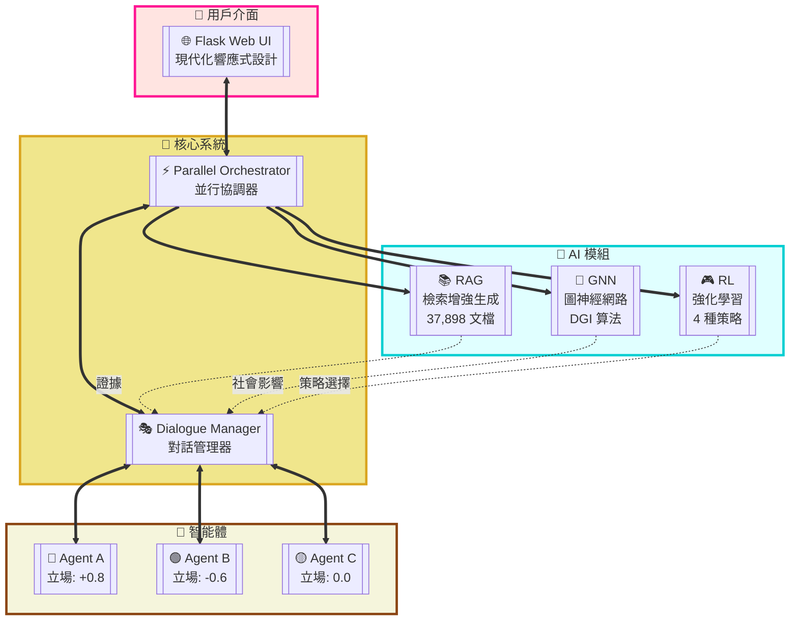
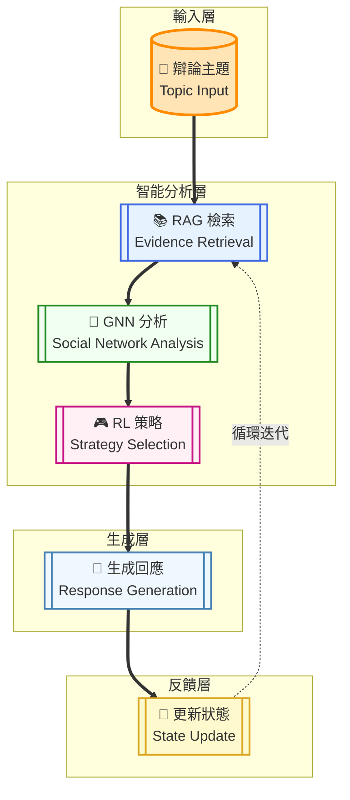
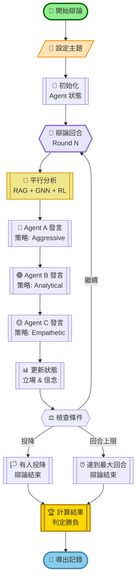

# 🤖 Social Debate AI

基於深度學習的多智能體社會辯論系統，整合 RAG、GNN、RL 技術實現智能辯論模擬。


## ✨ 特色功能

- 🎯 **多智能體辯論** - 3個具有不同立場的AI Agent進行動態辯論
- 📚 **RAG檢索增強** - 基於向量資料庫的證據檢索系統
- 🔗 **GNN社會網絡** - 模擬Agent間的社會關係和影響力
- 🎮 **RL策略學習** - 強化學習優化辯論策略選擇
- 🌐 **Web介面** - 現代化的Flask Web UI

## 🏗️ 系統架構總覽



## 🚀 快速開始

```bash
# 1. 克隆專案
git clone https://github.com/your-username/Social_Debate_AI.git
cd Social_Debate_AI

# 2. 安裝依賴
pip install -r requirements.txt

# 3. 運行系統
python run_flask.py

# 4. 訪問 http://localhost:5000
```

詳細安裝指南請見 [docs/QUICKSTART.md](docs/QUICKSTART.md)

## 📁 專案結構

```
Social_Debate_AI/
├── ui/                    # Flask Web 應用
│   ├── app.py             # 後端 API
│   ├── templates/         # HTML 模板
│   └── static/           # CSS/JS 資源
├── src/                   # 核心模組
│   ├── agents/           # Agent 實現
│   ├── rag/              # RAG 檢索系統
│   ├── gnn/              # GNN 社會網絡
│   ├── rl/               # RL 策略學習
│   └── orchestrator/     # 辯論協調器
├── configs/              # 配置檔案
├── scripts/              # 啟動腳本
├── docs/                 # 詳細文檔
└── tests/                # 測試套件
```

## 🎮 使用方式

### Web UI (推薦)
```bash
# Windows
scripts\start_flask.bat

# Linux/Mac
./scripts/start_flask.sh
```

### 命令行
```bash
python run_social_debate_ai.py
```

### 訓練模型
```bash
python train_models.py
```

## 📚 文檔

- [快速開始指南](docs/QUICKSTART.md)
- [專案結構說明](docs/PROJECT_STRUCTURE.md)
- [技術實現細節](docs/TECHNICAL_DETAILS.md)
- [訓練指南](docs/TRAINING_GUIDE.md)
- [RL使用指南](docs/RL_USAGE.md)

## 🛠️ 技術架構



## 📊 數據集

本專案使用以下數據集進行訓練：

### Reddit ChangeMyView Dataset
[](https://doi.org/10.5281/zenodo.3778297)

本專案的 RAG 檢索系統使用了 Reddit ChangeMyView 數據集，該數據集包含了豐富的辯論和說服性對話內容。

**引用方式**：
```bibtex
@dataset{reddit_changemyview,
  author       = {Reddit ChangeMyView Community},
  title        = {Reddit ChangeMyView Dataset},
  year         = {2020},
  publisher    = {Zenodo},
  doi          = {10.5281/zenodo.3778297},
  url          = {https://doi.org/10.5281/zenodo.3778297}
}
```

該數據集提供了：
- 37,898 個高質量的辯論文檔
- 多樣化的辯論主題和觀點
- 真實的說服策略和論證模式
- 豐富的元數據標註

## 🎯 辯論流程



## 🤝 貢獻指南

歡迎提交 Issue 和 Pull Request！

## 📄 授權

MIT License - 詳見 [LICENSE](LICENSE) 文件

---

⭐ 如果這個專案對您有幫助，請給我們一個 Star！ 