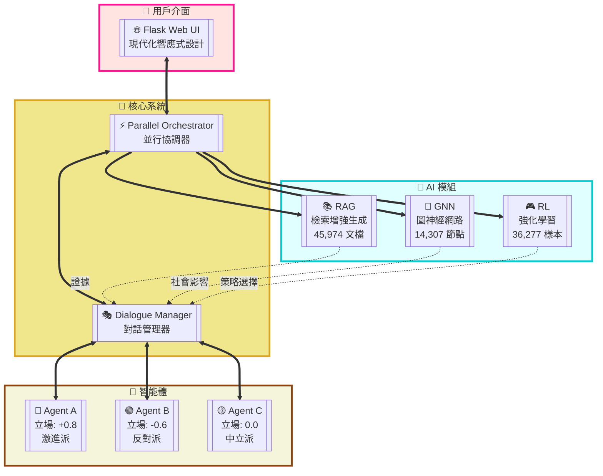

# 🤖 Social Debate AI

基於深度學習的多智能體社會辯論系統，整合 RAG、GNN、RL 技術實現智能辯論模擬。


## ✨ 核心特色

- 🎯 **多智能體辯論** - 3個具有不同立場和性格的AI Agent進行動態辯論
- 📚 **RAG檢索增強** - 基於 Chroma 向量資料庫，包含 45,974 個文檔
- 🔗 **GNN社會網絡** - Deep Graph Infomax (DGI) 算法模擬社會影響力
- 🎮 **RL策略學習** - 4種辯論策略動態選擇，36,277 個訓練樣本
- 🌐 **Web介面** - 現代化的 Flask + Bootstrap 5 響應式界面
- ⚡ **並行處理** - 異步架構，三大模組並行分析

## 🏗️ 系統架構



## 🚀 快速開始

### 環境要求
- Python 3.8+
- CUDA 11.8+ (可選，用於 GPU 加速)
- 8GB+ RAM
- OpenAI API Key (用於 RAG embeddings)

### 安裝步驟

```bash
# 1. 克隆專案
git clone https://github.com/your-username/Social_Debate_AI.git
cd Social_Debate_AI

# 2. 創建虛擬環境
conda create -n social_debate python=3.8
conda activate social_debate

# 3. 安裝依賴
pip install -r requirements.txt

# 4. 設置環境變數
cp env.example .env
# 編輯 .env 文件，添加您的 OPENAI_API_KEY

# 5. 下載預訓練模型（可選）
# 如果沒有預訓練模型，系統會自動訓練
```

### 快速運行

```bash
# 方式一：使用啟動腳本
# Windows
scripts\start_flask.bat

# Linux/Mac
./scripts/start_flask.sh

# 方式二：直接運行
python run_flask.py
```

訪問 http://localhost:5000 即可開始使用！

## 🎓 訓練模型

### 訓練所有模型
```bash
python train_all.py --all
```

### 單獨訓練
```bash
# 訓練 GNN 社會網絡模型
python train_all.py --gnn

# 訓練 RL 策略模型
python train_all.py --rl

# 構建 RAG 索引
python train_all.py --rag        # 簡單索引
python train_all.py --rag-chroma  # Chroma 向量索引
```

詳細訓練指南請見 [docs/TRAINING_GUIDE.md](docs/TRAINING_GUIDE.md)

## 📊 技術細節

### RAG 系統
- **向量資料庫**: Chroma
- **嵌入模型**: OpenAI text-embedding-3-small
- **文檔數量**: 45,974 個
- **檢索策略**: 相似度檢索 + 主題過濾 + 品質評分
- **元數據索引**: 12 個主題分類、說服成功標記、論證強度評分

### GNN 模型
- **算法**: Deep Graph Infomax (DGI)
- **圖規模**: 14,307 個節點，38,606 條邊
- **嵌入維度**: 128
- **訓練輪數**: 200 epochs
- **損失函數**: 對比學習損失

### RL 模型
- **基礎模型**: DistilBERT
- **訓練樣本**: 36,277 個
- **策略類型**: aggressive、defensive、analytical、empathetic
- **評估指標**: MSE、MAE、R²

### 辯論機制
- **投降條件**: 
  - 高說服度(>0.6) + 低信念(<0.4)
  - 立場接近中立(<0.2) + 信念較低(<0.5)
  - 連續3回合被高度說服(>0.5)
- **勝負判定**: 綜合考慮立場堅定度、說服他人能力、抗壓能力

## 📁 專案結構

```
Social_Debate_AI/
├── ui/                    # Flask Web 應用
│   ├── app.py            # 後端 API
│   ├── templates/        # HTML 模板
│   └── static/          # CSS/JS 資源
├── src/                  # 核心模組
│   ├── agents/          # Agent 實現
│   ├── rag/             # RAG 檢索系統
│   ├── gnn/             # GNN 社會網絡
│   ├── rl/              # RL 策略學習
│   ├── orchestrator/    # 辯論協調器
│   ├── dialogue/        # 對話管理
│   └── gpt_interface/   # GPT 接口
├── data/                 # 數據目錄
│   ├── raw/             # 原始數據
│   ├── models/          # 訓練模型
│   ├── chroma/          # 向量索引
│   └── rl/              # RL 訓練數據
├── configs/              # 配置檔案
├── scripts/              # 啟動腳本
├── docs/                 # 詳細文檔
└── tests/                # 測試套件
```

## 📚 文檔導覽

- [快速開始指南](docs/QUICKSTART.md) - 5分鐘上手教程
- [訓練指南](docs/TRAINING_GUIDE.md) - 完整的模型訓練說明
- [API 參考](docs/API_REFERENCE.md) - Flask API 接口文檔
- [部署指南](docs/DEPLOYMENT.md) - 生產環境部署說明

## 🎮 使用示例

### 1. 設置辯論主題
在 Web UI 中輸入您想討論的主題，例如：
- "人工智慧是否應該被政府監管？"
- "基本收入是否可行？"
- "社交媒體對社會的影響是正面還是負面？"

### 2. 觀察辯論過程
- Agent A（紅色）：激進支持派，立場 +0.8
- Agent B（綠色）：理性反對派，立場 -0.6
- Agent C（黃色）：中立觀察者，立場 0.0

### 3. 分析辯論結果
系統會自動：
- 評估每個發言的說服力、攻擊性和證據強度
- 更新 Agent 的立場和信念
- 判定是否有 Agent 被說服投降
- 最終給出勝負判定和詳細分析

## 🔧 配置說明

主要配置文件位於 `configs/` 目錄：

- `debate.yaml` - 辯論參數配置
- `rag.yaml` - RAG 系統配置
- `gnn.yaml` - GNN 模型配置
- `rl.yaml` - RL 訓練配置

## 📊 數據集

本專案使用 Reddit ChangeMyView 數據集：

[](https://doi.org/10.5281/zenodo.3778297)

**數據集特點**：
- 10,303 個辯論主題
- 17,716 個成功說服案例
- 18,561 個未成功說服案例
- 豐富的元數據標註

## 🤝 貢獻指南

歡迎貢獻代碼、報告問題或提出建議！

1. Fork 本專案
2. 創建您的特性分支 (`git checkout -b feature/AmazingFeature`)
3. 提交您的更改 (`git commit -m 'Add some AmazingFeature'`)
4. 推送到分支 (`git push origin feature/AmazingFeature`)
5. 開啟 Pull Request

## 📄 授權

本專案採用 MIT 授權 - 詳見 [LICENSE](LICENSE) 文件

## 🙏 致謝

- Reddit ChangeMyView 社區提供的高質量數據集
- PyTorch 團隊的深度學習框架
- LangChain 團隊的 RAG 工具鏈
- 所有貢獻者和使用者的支持

---

⭐ 如果這個專案對您有幫助，請給我們一個 Star！
