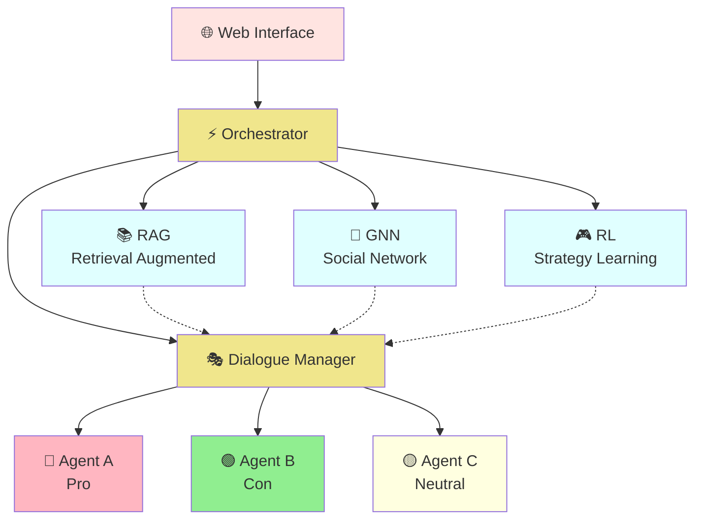
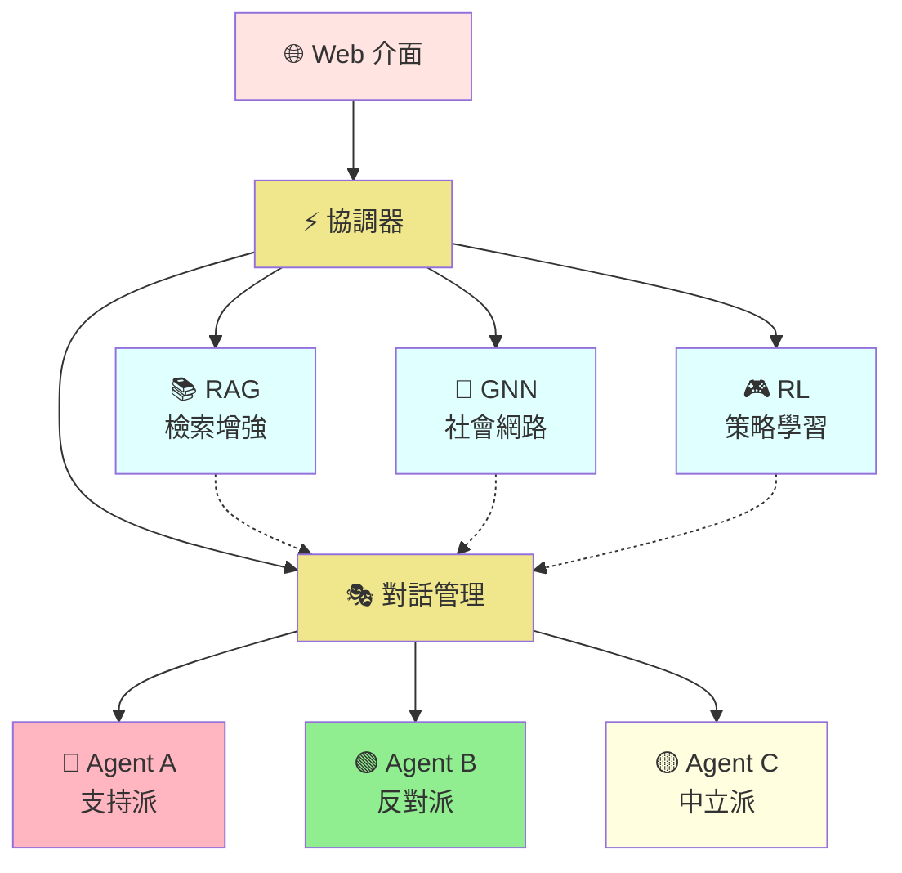

# 🤖 Social Debate AI

*English | [中文](#chinese-version)*

A deep learning-based multi-agent social debate system that integrates RAG, GNN, and RL technologies for intelligent debate simulation.


## ✨ Key Features

- 🎯 **Multi-Agent Debate** - 3 AI Agents with different stances and personalities engage in dynamic debates
- 📚 **RAG Enhancement** - Based on FAISS/Chroma vector databases, supporting hybrid retrieval and reranking
- 🔗 **GNN Social Network** - Supervised learning to predict persuasion success rate with multi-task learning architecture
- 🎮 **RL Strategy Learning** - PPO reinforcement learning with real environment interaction and 4 dynamic debate strategies
- 🌐 **Web Interface** - Modern Flask + Bootstrap 5 responsive interface
- ⚡ **Parallel Processing** - Asynchronous architecture with three modules analyzing in parallel

## 🏗️ System Architecture



## 🚀 Quick Start

### Requirements
- Python 3.8+
- CUDA 11.8+ (optional, for GPU acceleration)
- 8GB+ RAM
- OpenAI API Key (for RAG embeddings)

### Installation

```bash
# 1. Clone the project
git clone https://github.com/your-username/Social_Debate_AI.git
cd Social_Debate_AI

# 2. Create virtual environment
conda create -n social_debate python=3.8
conda activate social_debate

# 3. Install dependencies
pip install -r requirements.txt

# 4. Set environment variables
cp env.example .env
# Edit .env file, add your OPENAI_API_KEY

# 5. Download pre-trained models (optional)
# If no pre-trained models, the system will train automatically
```

### Quick Run

```bash
# Method 1: Use startup script
# Windows
scripts\start_flask.bat

# Linux/Mac
./scripts/start_flask.sh

# Method 2: Direct run
python run_flask.py
```

Visit http://localhost:5000 to start using!

## 🎓 Training Models

### Train All Models
```bash
python train_all.py --all
```

### Individual Training
```bash
# Train GNN social network model
python train_all.py --gnn

# Train RL strategy model
python train_all.py --rl

# Build RAG index
python train_all.py --rag        # Simple index
python train_all.py --rag-chroma  # Chroma vector index
```

For detailed training guide, see [docs/TRAINING_GUIDE.md](docs/TRAINING_GUIDE.md)

## 📊 Technical Details

### RAG System
- **Vector Database**: FAISS + Chroma
- **Embedding Model**: BERT/Sentence-BERT
- **Retrieval Strategy**: Hybrid retrieval (Vector + BM25) + Learned reranking
- **Features**: Batch processing, incremental updates, context-aware retrieval
- **Optimizations**: IVF indexing, GPU acceleration, query caching

### GNN Model
- **Algorithm**: Supervised learning (GraphSAGE + GAT)
- **Task Type**: Multi-task learning
  - Delta prediction (binary classification)
  - Quality scoring (regression)
  - Strategy classification (multi-class)
- **Architecture**: 3-layer GraphSAGE + GAT attention mechanism
- **Performance**: Delta accuracy 67.77%, Strategy accuracy 64.47%
- **Integration**: Predict persuasion success rate, recommend optimal strategies

### RL Model
- **Algorithm**: PPO (Proximal Policy Optimization)
- **Network**: Actor-Critic dual networks
- **Action Space**: 4 strategies (aggressive, defensive, analytical, empathetic)
- **Reward Design**: 
  - Strategy effectiveness reward
  - Persuasion success reward
  - Strategy diversity reward
- **Environment**: Real debate environment simulation with state transitions and termination conditions

### Debate Mechanism
- **Surrender Conditions**: 
  - High persuasion (>0.6) + Low belief (<0.4)
  - Near-neutral stance (<0.2) + Lower belief (<0.5)
  - Highly persuaded for 3 consecutive rounds (>0.5)
- **Victory Determination**: Comprehensive consideration of stance firmness, persuasion ability, and resistance

## 📁 Project Structure

```
Social_Debate_AI/
├── ui/                    # Flask Web Application
│   ├── app.py            # Backend API
│   ├── templates/        # HTML Templates
│   └── static/          # CSS/JS Resources
├── src/                  # Core Modules
│   ├── agents/          # Agent Implementation
│   ├── rag/             # RAG Retrieval System
│   ├── gnn/             # GNN Social Network
│   ├── rl/              # RL Strategy Learning
│   ├── orchestrator/    # Debate Orchestrator
│   ├── dialogue/        # Dialogue Management
│   └── gpt_interface/   # GPT Interface
├── data/                 # Data Directory
│   ├── raw/             # Raw Data
│   ├── models/          # Trained Models
│   ├── chroma/          # Vector Index
│   └── rl/              # RL Training Data
├── configs/              # Configuration Files
├── scripts/              # Startup Scripts
├── docs/                 # Detailed Documentation
└── tests/                # Test Suite
```

## 📚 Documentation

### User Guides
- [Quick Start Guide](docs/QUICKSTART.md) - 5-minute tutorial
- [Training Guide](docs/TRAINING_GUIDE.md) - Complete model training instructions
- [Configuration Guide](docs/CONFIGURATION_GUIDE.md) - Detailed system configuration
- [Debate Scoring System](docs/DEBATE_SCORING_SYSTEM.md) - Victory determination mechanism

### Technical Documentation
- [API Reference](docs/API_REFERENCE.md) - Flask API interface documentation
- [Deployment Guide](docs/DEPLOYMENT.md) - Production deployment instructions

### Module Documentation
- [GNN Module](docs/GNN_MODULE.md) - Graph Neural Network detailed documentation
- [RL Module](docs/RL_MODULE.md) - Reinforcement Learning detailed documentation
- [RAG Module](docs/RAG_MODULE.md) - Retrieval Augmented Generation detailed documentation

## 🎮 Usage Examples

### 1. Set Debate Topic
Enter your discussion topic in the Web UI, for example:
- "Should artificial intelligence be regulated by government?"
- "Is universal basic income feasible?"
- "Is social media's impact on society positive or negative?"

### 2. Observe Debate Process
- Agent A (Red): Aggressive pro side, stance +0.8
- Agent B (Green): Rational con side, stance -0.6
- Agent C (Yellow): Neutral observer, stance 0.0

### 3. Analyze Debate Results
The system automatically:
- Evaluates persuasiveness, aggressiveness, and evidence strength of each statement
- Updates agents' stances and beliefs
- Determines if any agent has been persuaded to surrender
- Provides final victory determination and detailed analysis

## 🔧 Configuration

Main configuration files are located in the `configs/` directory:

- `debate.yaml` - Debate parameter configuration
- `rag.yaml` - RAG system configuration
- `gnn.yaml` - GNN model configuration
- `rl.yaml` - RL training configuration

## 📊 Dataset

This project uses the Reddit ChangeMyView dataset:

[](https://doi.org/10.5281/zenodo.3778297)

**Dataset Features**:
- 10,303 debate topics
- 17,716 successful persuasion cases
- 18,561 unsuccessful persuasion cases
- Rich metadata annotations

## 🤝 Contributing

We welcome code contributions, issue reports, and suggestions!

1. Fork this project
2. Create your feature branch (`git checkout -b feature/AmazingFeature`)
3. Commit your changes (`git commit -m 'Add some AmazingFeature'`)
4. Push to the branch (`git push origin feature/AmazingFeature`)
5. Open a Pull Request

## 📄 License

This project is licensed under the MIT License - see the [LICENSE](LICENSE) file for details

## 🙏 Acknowledgments

- Reddit ChangeMyView community for providing high-quality dataset
- PyTorch team for the deep learning framework
- LangChain team for RAG toolchain
- All contributors and users for their support

---

⭐ If this project helps you, please give us a Star!

---

## Chinese Version

# 🤖 Social Debate AI

*[English](#social-debate-ai) | 中文*

基於深度學習的多智能體社會辯論系統，整合 RAG、GNN、RL 技術實現智能辯論模擬。


## ✨ 核心特色

- 🎯 **多智能體辯論** - 3個具有不同立場和性格的AI Agent進行動態辯論
- 📚 **RAG檢索增強** - 基於 FAISS/Chroma 向量資料庫，支援混合檢索和重排序
- 🔗 **GNN社會網絡** - 監督式學習預測說服成功率，多任務學習架構
- 🎮 **RL策略學習** - PPO強化學習，真實環境互動，4種辯論策略動態選擇
- 🌐 **Web介面** - 現代化的 Flask + Bootstrap 5 響應式界面
- ⚡ **並行處理** - 異步架構，三大模組並行分析

## 🏗️ 系統架構



## 🚀 快速開始

### 環境要求
- Python 3.8+
- CUDA 11.8+ (可選，用於 GPU 加速)
- 8GB+ RAM
- OpenAI API Key (用於 RAG embeddings)

### 安裝步驟

```bash
# 1. 克隆專案
git clone https://github.com/your-username/Social_Debate_AI.git
cd Social_Debate_AI

# 2. 創建虛擬環境
conda create -n social_debate python=3.8
conda activate social_debate

# 3. 安裝依賴
pip install -r requirements.txt

# 4. 設置環境變數
cp env.example .env
# 編輯 .env 文件，添加您的 OPENAI_API_KEY

# 5. 下載預訓練模型（可選）
# 如果沒有預訓練模型，系統會自動訓練
```

### 快速運行

```bash
# 方式一：使用啟動腳本
# Windows
scripts\start_flask.bat

# Linux/Mac
./scripts/start_flask.sh

# 方式二：直接運行
python run_flask.py
```

訪問 http://localhost:5000 即可開始使用！

## 🎓 訓練模型

### 訓練所有模型
```bash
python train_all.py --all
```

### 單獨訓練
```bash
# 訓練 GNN 社會網絡模型
python train_all.py --gnn

# 訓練 RL 策略模型
python train_all.py --rl

# 構建 RAG 索引
python train_all.py --rag        # 簡單索引
python train_all.py --rag-chroma  # Chroma 向量索引
```

詳細訓練指南請見 [docs/TRAINING_GUIDE.md](docs/TRAINING_GUIDE.md)

## 📊 技術細節

### RAG 系統
- **向量資料庫**: FAISS + Chroma
- **嵌入模型**: BERT/Sentence-BERT
- **檢索策略**: 混合檢索（向量 + BM25）+ 學習式重排序
- **支援功能**: 批次處理、增量更新、上下文感知檢索
- **優化技術**: IVF索引、GPU加速、查詢快取

### GNN 模型
- **算法**: 監督式學習（GraphSAGE + GAT）
- **任務類型**: 多任務學習
  - Delta 預測（二分類）
  - 品質評分（回歸）
  - 策略分類（多分類）
- **模型架構**: 3層 GraphSAGE + GAT 注意力機制
- **訓練效果**: Delta 準確率 67.77%，策略準確率 64.47%
- **整合功能**: 預測說服成功率、推薦最佳策略

### RL 模型
- **算法**: PPO (Proximal Policy Optimization)
- **網路架構**: Actor-Critic 雙網路
- **動作空間**: 4種策略（aggressive、defensive、analytical、empathetic）
- **獎勵設計**: 
  - 策略效果獎勵
  - 說服成功獎勵
  - 策略多樣性獎勵
- **環境設計**: 真實辯論環境模擬，包含狀態轉移和終止條件

### 辯論機制
- **投降條件**: 
  - 高說服度(>0.6) + 低信念(<0.4)
  - 立場接近中立(<0.2) + 信念較低(<0.5)
  - 連續3回合被高度說服(>0.5)
- **勝負判定**: 綜合考慮立場堅定度、說服他人能力、抗壓能力

## 📁 專案結構

```
Social_Debate_AI/
├── ui/                    # Flask Web 應用
│   ├── app.py            # 後端 API
│   ├── templates/        # HTML 模板
│   └── static/          # CSS/JS 資源
├── src/                  # 核心模組
│   ├── agents/          # Agent 實現
│   ├── rag/             # RAG 檢索系統
│   ├── gnn/             # GNN 社會網絡
│   ├── rl/              # RL 策略學習
│   ├── orchestrator/    # 辯論協調器
│   ├── dialogue/        # 對話管理
│   └── gpt_interface/   # GPT 接口
├── data/                 # 數據目錄
│   ├── raw/             # 原始數據
│   ├── models/          # 訓練模型
│   ├── chroma/          # 向量索引
│   └── rl/              # RL 訓練數據
├── configs/              # 配置檔案
├── scripts/              # 啟動腳本
├── docs/                 # 詳細文檔
└── tests/                # 測試套件
```

## 📚 文檔導覽

### 使用指南
- [快速開始指南](docs/QUICKSTART.md) - 5分鐘上手教程
- [訓練指南](docs/TRAINING_GUIDE.md) - 完整的模型訓練說明
- [配置指南](docs/CONFIGURATION_GUIDE.md) - 系統配置詳細說明
- [辯論評分系統](docs/DEBATE_SCORING_SYSTEM.md) - 勝負判定機制詳解

### 技術文檔
- [API 參考](docs/API_REFERENCE.md) - Flask API 接口文檔
- [部署指南](docs/DEPLOYMENT.md) - 生產環境部署說明

### 模組說明
- [GNN 模組說明](docs/GNN_MODULE.md) - 圖神經網路詳細文檔
- [RL 模組說明](docs/RL_MODULE.md) - 強化學習詳細文檔
- [RAG 模組說明](docs/RAG_MODULE.md) - 檢索增強生成詳細文檔

## 🎮 使用示例

### 1. 設置辯論主題
在 Web UI 中輸入您想討論的主題，例如：
- "人工智慧是否應該被政府監管？"
- "基本收入是否可行？"
- "社交媒體對社會的影響是正面還是負面？"

### 2. 觀察辯論過程
- Agent A（紅色）：激進支持派，立場 +0.8
- Agent B（綠色）：理性反對派，立場 -0.6
- Agent C（黃色）：中立觀察者，立場 0.0

### 3. 分析辯論結果
系統會自動：
- 評估每個發言的說服力、攻擊性和證據強度
- 更新 Agent 的立場和信念
- 判定是否有 Agent 被說服投降
- 最終給出勝負判定和詳細分析

## 🔧 配置說明

主要配置文件位於 `configs/` 目錄：

- `debate.yaml` - 辯論參數配置
- `rag.yaml` - RAG 系統配置
- `gnn.yaml` - GNN 模型配置
- `rl.yaml` - RL 訓練配置

## 📊 數據集

本專案使用 Reddit ChangeMyView 數據集：

[](https://doi.org/10.5281/zenodo.3778297)

**數據集特點**：
- 10,303 個辯論主題
- 17,716 個成功說服案例
- 18,561 個未成功說服案例
- 豐富的元數據標註

## 🤝 貢獻指南

歡迎貢獻代碼、報告問題或提出建議！

1. Fork 本專案
2. 創建您的特性分支 (`git checkout -b feature/AmazingFeature`)
3. 提交您的更改 (`git commit -m 'Add some AmazingFeature'`)
4. 推送到分支 (`git push origin feature/AmazingFeature`)
5. 開啟 Pull Request

## 📄 授權

本專案採用 MIT 授權 - 詳見 [LICENSE](LICENSE) 文件

## 🙏 致謝

- Reddit ChangeMyView 社區提供的高質量數據集
- PyTorch 團隊的深度學習框架
- LangChain 團隊的 RAG 工具鏈
- 所有貢獻者和使用者的支持

---

⭐ 如果這個專案對您有幫助，請給我們一個 Star！
