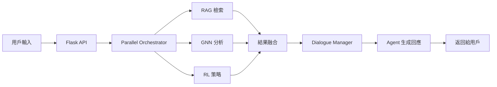

# 📁 專案結構說明

## 🗂️ 目錄結構

```
Social_Debate_AI/
│
├── 📂 ui/                      # Flask Web 應用
│   ├── 📄 app.py              # 後端 API 服務
│   ├── 📂 templates/          # HTML 模板
│   │   └── index.html         # 主頁面
│   └── 📂 static/             # 靜態資源
│       ├── 📂 css/            # 樣式表
│       └── 📂 js/             # JavaScript
│
├── 📂 src/                     # 核心源代碼
│   ├── 📂 agents/             # AI Agent 實現
│   │   ├── base_agent.py     # 基礎 Agent 類
│   │   ├── agent_a.py        # Agent A (支持立場)
│   │   ├── agent_b.py        # Agent B (反對立場)
│   │   └── agent_c.py        # Agent C (中立立場)
│   │
│   ├── 📂 rag/                # RAG 檢索系統
│   │   ├── retriever.py      # Chroma 檢索器
│   │   ├── simple_retriever.py # 簡化檢索器
│   │   └── build_index.py    # 索引構建
│   │
│   ├── 📂 gnn/                # GNN 社會網絡
│   │   ├── social_encoder.py # DGI 模型實現
│   │   └── build_graph.py    # 圖構建工具
│   │
│   ├── 📂 rl/                 # RL 策略學習
│   │   ├── policy_network.py # 策略網路
│   │   ├── data_processor_enhanced.py # 數據處理
│   │   ├── trainer.py        # 模型訓練
│   │   ├── evaluator.py      # 模型評估
│   │   └── pipeline_enhanced.py # 訓練管線
│   │
│   ├── 📂 orchestrator/       # 辯論協調器
│   │   ├── parallel_orchestrator.py # 並行協調
│   │   └── context_builder.py # 上下文構建
│   │
│   ├── 📂 dialogue/           # 對話管理
│   │   └── dialogue_manager.py # 對話流程控制
│   │
│   ├── 📂 gpt_interface/      # GPT 接口
│   │   └── gpt_client.py     # OpenAI API 封裝
│   │
│   └── 📂 utils/              # 工具函數
│       └── config_loader.py   # 配置載入器
│
├── 📂 configs/                 # 配置文件
│   ├── debate.yaml            # 辯論配置
│   ├── gnn.yaml              # GNN 配置
│   ├── rag.yaml              # RAG 配置
│   └── rl.yaml               # RL 配置
│
├── 📂 scripts/                 # 啟動腳本
│   ├── start_flask.bat       # Windows 啟動
│   └── start_flask.sh        # Linux/Mac 啟動
│
├── 📂 docs/                    # 文檔資料
│   ├── INDEX.md              # 文檔索引
│   ├── QUICKSTART.md         # 快速開始
│   ├── PROJECT_STRUCTURE.md  # 專案結構 (本文件)
│   ├── TECHNICAL_DETAILS.md  # 技術細節
│   ├── RL_TRAINING_GUIDE.md  # RL 訓練指南
│   ├── API_REFERENCE.md      # API 參考
│   └── DEPLOYMENT.md         # 部署指南
│
├── 📂 data/                    # 數據目錄 (自動生成)
│   ├── 📂 models/            # 訓練模型
│   │   └── 📂 policy/        # RL 策略模型
│   ├── 📂 chroma/            # Chroma 向量資料庫
│   └── 📂 rag/               # RAG 索引
│
├── 📄 run_flask.py            # Flask 啟動入口
├── 📄 run_social_debate_ai.py # 命令行入口
├── 📄 train_models.py         # 統一訓練腳本
├── 📄 requirements.txt        # Python 依賴
├── 📄 .env.example           # 環境變數範例
├── 📄 README.md              # 專案說明
├── 📄 LICENSE                # 授權文件
└── 📄 setup.py               # 安裝配置
```

## 🔑 關鍵模組說明

### 🎯 入口點
| 文件 | 用途 | 使用方式 |
|------|------|----------|
| `run_flask.py` | Web UI 啟動 | `python run_flask.py` |
| `run_social_debate_ai.py` | 命令行模式 | `python run_social_debate_ai.py` |
| `train_models.py` | 訓練所有模型 | `python train_models.py` |

### 🧠 核心模組

#### Agents (智能體)
- **base_agent.py**: 定義 Agent 基礎類別和介面
- **agent_a/b/c.py**: 三個不同立場的 Agent 實現

#### RAG (檢索增強生成)
- **retriever.py**: 基於 Chroma 的向量檢索
- **simple_retriever.py**: 備用的簡化檢索器
- **build_index.py**: 構建向量索引工具

#### GNN (圖神經網路)
- **social_encoder.py**: Deep Graph Infomax 實現
- **build_graph.py**: 社會網路圖構建

#### RL (強化學習)
- **policy_network.py**: 策略網路和品質評估
- **trainer.py**: 模型訓練邏輯
- **evaluator.py**: 性能評估工具

#### Orchestrator (協調器)
- **parallel_orchestrator.py**: 並行執行 RAG/GNN/RL
- **context_builder.py**: 構建辯論上下文

### 🌐 Web 應用
- **ui/app.py**: Flask RESTful API
- **ui/templates/**: HTML 前端頁面
- **ui/static/**: CSS 樣式和 JS 腳本

### ⚙️ 配置文件
- **debate.yaml**: 辯論參數（回合數、Agent 設定）
- **gnn.yaml**: GNN 模型參數
- **rag.yaml**: 檢索系統配置
- **rl.yaml**: RL 訓練參數

## 📊 數據流向



## 🚀 快速導航

- 想了解如何運行？查看 [QUICKSTART.md](QUICKSTART.md)
- 想了解技術原理？查看 [TECHNICAL_DETAILS.md](TECHNICAL_DETAILS.md)
- 想訓練模型？查看 [RL_TRAINING_GUIDE.md](RL_TRAINING_GUIDE.md)
- 想調用 API？查看 [API_REFERENCE.md](API_REFERENCE.md)
- 想部署系統？查看 [DEPLOYMENT.md](DEPLOYMENT.md) 