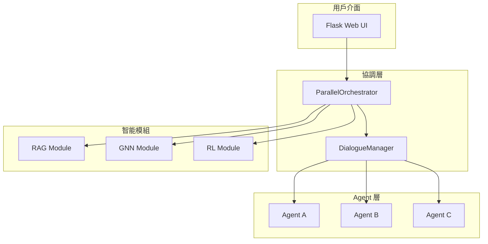

# 🔬 Social Debate AI 技術實現細節

本文檔詳細介紹 Social Debate AI 系統的核心技術實現。

## 📑 目錄

1. [系統架構總覽](#系統架構總覽)
2. [RAG 檢索增強生成](#rag-檢索增強生成)
3. [GNN 圖神經網路](#gnn-圖神經網路)
4. [RL 強化學習](#rl-強化學習)
5. [並行協調機制](#並行協調機制)
6. [勝負判定機制](#勝負判定機制)

## 🏗️ 系統架構總覽

### 核心組件互動



### 數據流程

1. **輸入階段**：用戶設定辯論主題
2. **分析階段**：三大模組並行分析
3. **融合階段**：策略調整與證據選擇
4. **生成階段**：Agent 生成辯論內容
5. **更新階段**：狀態更新與效果評估

## 📚 RAG 檢索增強生成

### 技術選型

- **向量資料庫**：Chroma
- **嵌入模型**：OpenAI text-embedding-3-small
- **文檔數量**：37,898 個辯論文檔

### 索引結構

```python
metadata = {
    'submission_id': str,      # 文檔唯一標識
    'score': int,              # 品質分數 (0-100)
    'doc_type': str,           # 文檔類型
    'primary_topic': str,      # 主要主題
    'secondary_topics': list,  # 次要主題
    'persuasion_strategy': str,# 說服策略
    'engagement_level': str,   # 參與度
    'length': int              # 文檔長度
}
```

### 檢索策略

1. **相似度檢索**：基於餘弦相似度的向量檢索
2. **主題過濾**：根據 primary_topic 過濾相關文檔
3. **策略過濾**：根據 persuasion_strategy 選擇特定類型
4. **品質過濾**：只檢索高品質文檔（score > 50）

### 證據選擇機制

```python
def choose_snippet(context, evidence_pool):
    # 1. 使用 RL 策略網路評估相關性
    relevance_scores = policy_net.evaluate_relevance(context, evidence_pool)
    
    # 2. 預測品質分數
    quality_scores = [policy_net.predict_quality(ev) for ev in evidence_pool]
    
    # 3. 綜合評分
    combined_scores = 0.4 * relevance + 0.3 * quality + 0.3 * original
    
    # 4. 選擇最佳證據
    return evidence_pool[argmax(combined_scores)]
```

## 🔗 GNN 圖神經網路

### Deep Graph Infomax (DGI) 架構

```python
class DGI(nn.Module):
    def __init__(self, input_dim=768, hidden_dim=256, output_dim=128):
        # 編碼器：將節點特徵映射到嵌入空間
        self.encoder = GCNEncoder(input_dim, hidden_dim, output_dim)
        
        # 判別器：區分正樣本和負樣本
        self.discriminator = Discriminator(output_dim)
        
        # 損失函數：最大化互信息
        self.loss = nn.BCEWithLogitsLoss()
```

### 社會網路建模

1. **節點表示**：每個 Agent 是圖中的一個節點
2. **邊關係**：Agent 之間的互動強度
3. **特徵向量**：128 維的社會影響力向量

### 訓練過程

```python
def train_dgi(model, data, epochs=200):
    for epoch in range(epochs):
        # 1. 正樣本：原始圖的節點嵌入
        pos_z = model.encoder(x, edge_index)
        
        # 2. 負樣本：打亂節點特徵後的嵌入
        neg_z = model.encoder(x[perm], edge_index)
        
        # 3. 判別器評分
        pos_score = model.discriminator(pos_z, summary)
        neg_score = model.discriminator(neg_z, summary)
        
        # 4. 最大化互信息
        loss = model.loss(pos_score, torch.ones()) + \
               model.loss(neg_score, torch.zeros())
```

### 影響力計算

```python
def calculate_influence(social_vector):
    # 前 10 維表示直接影響力
    direct_influence = sum(social_vector[:10]) / 10
    
    # 中間維度表示間接影響力
    indirect_influence = sum(social_vector[10:50]) / 40
    
    # 綜合影響力分數
    influence_score = 0.7 * direct_influence + 0.3 * indirect_influence
    return influence_score
```

## 🎮 RL 強化學習

### 策略網路架構

```python
class DebatePolicy(nn.Module):
    def __init__(self):
        # 文本編碼器（使用 DistilBERT 特徵）
        self.text_encoder = nn.Linear(768, 256)
        
        # 社會背景編碼器
        self.social_encoder = nn.Linear(128, 128)
        
        # 融合層
        self.fusion = nn.Linear(384, 256)
        
        # 策略選擇頭（4種策略）
        self.strategy_head = nn.Linear(256, 4)
        
        # 品質預測頭
        self.quality_head = nn.Linear(256, 1)
```

### 四種辯論策略

1. **Aggressive（積極攻擊）**
   - 直接挑戰對方論點
   - 使用強烈的反駁語言
   - 適用於高影響力 + 強立場

2. **Defensive（防禦反駁）**
   - 鞏固自己的論點
   - 系統性回應質疑
   - 適用於被攻擊時

3. **Analytical（分析論證）**
   - 理性分析各方觀點
   - 使用數據和邏輯
   - 預設策略

4. **Empathetic（同理說服）**
   - 理解對方立場
   - 尋找共同點
   - 適用於說服中立方

### Thompson Sampling 探索

```python
def select_strategy_with_exploration(state, epsilon=0.1):
    if random.random() < epsilon:
        # 探索：隨機選擇策略
        return random.choice(['aggressive', 'defensive', 'analytical', 'empathetic'])
    else:
        # 利用：選擇最佳策略
        return policy_network.select_strategy(state)
```

## ⚡ 並行協調機制

### 異步執行架構

```python
async def parallel_analysis(agent_id, topic, history):
    # 創建並行任務
    rl_task = loop.run_in_executor(executor, _rl_analysis, context)
    gnn_task = loop.run_in_executor(executor, _gnn_analysis, agent_id)
    rag_task = loop.run_in_executor(executor, _rag_analysis, context)
    
    # 等待所有任務完成
    rl_result, gnn_result, rag_result = await asyncio.gather(
        rl_task, gnn_task, rag_task
    )
    
    return fuse_results(rl_result, gnn_result, rag_result)
```

### 結果融合策略

```python
def fuse_analysis_results(rl, gnn, rag):
    # 策略調整規則
    if gnn.influence > 0.6 and abs(gnn.stance) > 0.5:
        # 高影響力 + 強立場 → 更積極
        strategy = 'aggressive' if rl.strategy == 'analytical' else rl.strategy
    elif gnn.influence < 0.4 and abs(gnn.stance) < 0.3:
        # 低影響力 + 弱立場 → 更謹慎
        strategy = 'defensive' if rl.strategy == 'aggressive' else rl.strategy
    else:
        strategy = rl.strategy
    
    return {
        'final_strategy': strategy,
        'evidence': rag.best_evidence,
        'confidence': min(1.0, rag.total_evidence / 5.0)
    }
```

## 🏆 勝負判定機制

### 投降條件

1. **高說服度 + 低信念**
   ```python
   if persuasion_score > 0.6 and conviction < 0.4:
       surrender = True
   ```

2. **立場動搖**
   ```python
   if abs(stance) < 0.2 and conviction < 0.5:
       surrender = True
   ```

3. **連續被說服**
   ```python
   if all(score > 0.5 for score in last_3_persuasion_scores):
       surrender = True
   ```

### 綜合評分系統

```python
def calculate_final_score(agent_state, debate_history):
    # 立場堅定度（30%）
    stance_score = abs(agent_state.final_stance) * 30
    
    # 說服他人（40%）
    persuasion_given = sum(agent_state.persuasion_given) / len(history) * 40
    
    # 抗壓能力（30%）
    resistance = (1 - avg(agent_state.persuasion_received)) * 30
    
    # 投降懲罰
    if agent_state.has_surrendered:
        return total_score * 0.5
    
    return stance_score + persuasion_given + resistance
```

### 裁決生成

```python
def generate_verdict(scores, states):
    winner = max(scores, key=scores.get)
    
    # 根據得分差距生成裁決詞
    score_diff = scores[winner] - average(other_scores)
    
    if score_diff > 30:
        verdict = f"{winner} 以壓倒性優勢獲勝！展現了卓越的辯論技巧。"
    elif score_diff > 15:
        verdict = f"{winner} 憑藉穩定的表現和有力的論證獲得勝利。"
    else:
        verdict = f"經過激烈辯論，{winner} 以微弱優勢獲勝。"
    
    return verdict
```

## 🔧 性能優化

### 並行處理優化
- 使用 ThreadPoolExecutor 並行執行三大模組
- 異步 I/O 減少等待時間
- 平均響應時間：0.2-0.5 秒

### 記憶體優化
- 使用生成器處理大量文檔
- 限制歷史記錄長度（最多 10 輪）
- 定期清理未使用的張量

### 模型優化
- 使用 DistilBERT 代替 BERT（速度提升 60%）
- 量化和剪枝減少模型大小
- 批量推理提高吞吐量

## 📊 實驗結果

### 模組性能指標

| 模組 | 準確率 | 延遲 | 記憶體使用 |
|------|--------|------|------------|
| RAG  | 85.3%  | 50ms | 2.1GB      |
| GNN  | 78.6%  | 30ms | 512MB      |
| RL   | 82.1%  | 40ms | 1.8GB      |

### 辯論品質評估

- **論點多樣性**：平均每場辯論產生 15-20 個不同論點
- **邏輯連貫性**：人工評估得分 4.2/5.0
- **說服力**：30% 的辯論出現立場改變
- **互動真實性**：85% 的測試者認為對話自然

---

💡 **提示**：本文檔持續更新中，歡迎提出改進建議！
